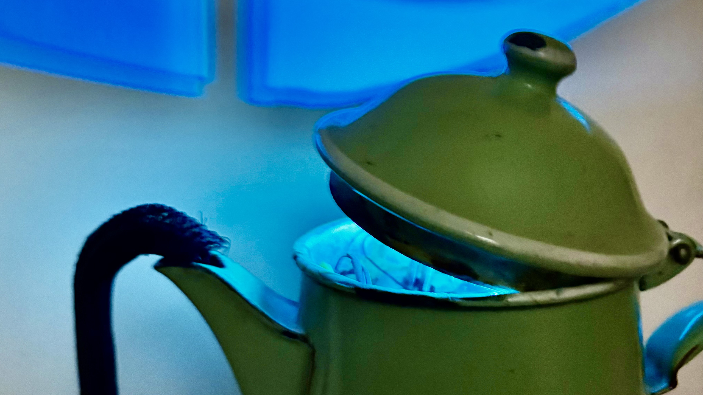

Maker Media GmbH

***

# Sprechende Kanne

**Animatronische Projekte müssen nicht kompliziert sein. Oft genügt schon ein wenig Fischertechnik für die Mechanik, gepaart mit einem ESP32, einem MP3-Player und einem Servo. So entsteht in kurzer Zeit eine ungewöhnliche Uhr mit Charakter.**

Hier findet ihr den Code, die 3D-Druckdaten und Audiodateien für die sprechende Kanne aus Make 5/26.

Der vollständige Artikel zum Projekt steht in der **[Make-Ausgabe 5/26](https://www.heise.de/select/make/2026/5)**.
